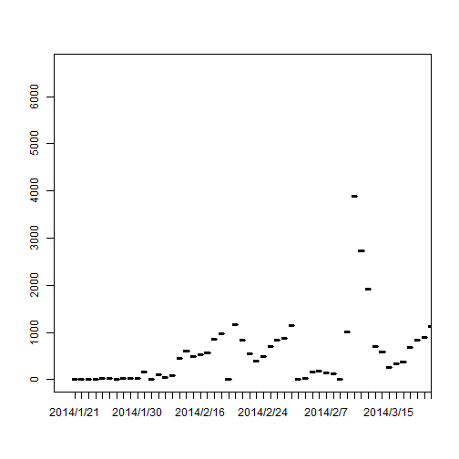

## Introduction

1. Background: our campaign promotion an APP via multi-channels, we need show performance of different channel on daily bases.
2. Tools I used: R with Shiny package, an really impressive tool.
3. Link to our app url(https://lexrf.shinyapps.io/InstallReport/)

--- .class #id 

## How I do it.

1. Use pageWithSidebar layout
2. Use selectInput to build drop-down box to select channel
3. Use sliderInput to control the date range
4. In the background, use levels to retrieve the channel list, use plot to draw the chart.

---

## Key advantages

1. Free access: No HDD, no USB, no need to carry a laptop. As long as you have web browser and connect internet, you can get my report. 
2. Dynamic content: you can choose channel and date range as you wish, throw ppts away!
3. Easy to maintain: Report will refresh automaticatly by upload a simple CSV with column "Date","Channel" and Installs.

---

## An Example Chart

 

--- &radio

## Question 

Do you like my work?

1. _Yes, I like it!_
2. No, I don't like it

*** .hint
I love you!

